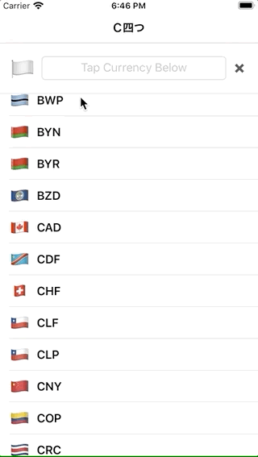

# Ｃ四つ - Currency Converter Coding Challenge

## Summary
A sample app that uses SwiftUI and Combine with the [CurrencyLayer.com]( https://currencylayer.com/documentation) API to make a simple currency converter application. A requirement of this project was to cache the result of the API Fetch for 30 minutes before fetching it again. The projects include tests that test the model and fetching / caching code. Also, the project makes use of Swift Previews to make modifying the UI very fast and easy.

## Features of Note
### `Cacher` Class
An object that wraps a Combine `Publisher` to fetch and cache any `Codable` type. `Cacher` uses closures that return `Futures` for the "Original Load" "Cache Write" and "Cache Read". This makes it extremely flexible. It can fetch and write the data to anywhere. Its also easy to test. 

### ViewModels
This project has two view models for the main view. `UserInputViewModel` and `DataSourceViewModel`. These two classes do as they describe, one handles user input, e.g. which currency is selected and how much did the user type in. The other one handles download and caching the data from the API. Its a little unusual to have more than 1 view model for a given view, but I think its important to attempt to follow SOLID principles with ViewModels as much as possible.

### Testing
- `Cacher`: The tests mostly verify that cacher does not execute the network request when the cache is valid and does execute the network request when the cache is missing or expired.
- `Model`: The tests verify that the Codable implementation is working correctly.
- `UserInputViewModel`: Tests that the String formatting and basic currency conversion math work correctly.

## Future Improvements
If I had more time, I would like  to add the following features:
- Add better error handling for network requests
- Add Search for desired currency. Scrolling through the list can be tedious
- Favorite important currencies that always show at the top
- Add row selection to see which row is currently be calculated against
- Add iPad optimized layout
- Figure out how to do the List layout correctly in SwiftUI. 
    - Right now, it does not go under the Navigation Bar and does not get the nice blur effect

## Demo

